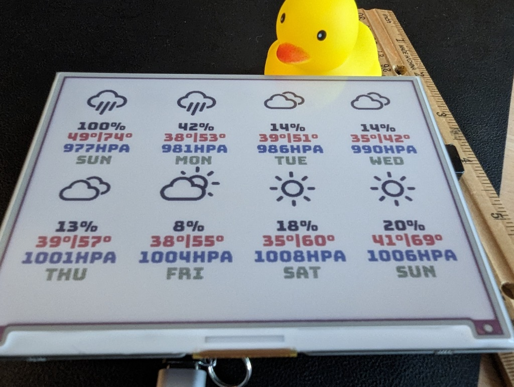

# Inky Impression Weather Station

Draw the 7 day weather forecast on an Inky Impression eInk display running on a Raspberry Pi.

Uses the [Pirate Weather API](https://www.pirateweather.net), which is currently free at 10k requests per month.

Forked and stripped down from https://github.com/vwillcox/Inky-Impression-Weather-Station, forked from https://github.com/rbunger/Inky-wHAT-Weather-Station

**This code is worse than the code it forks, so you might want to look at one of the other projects.**

# Examples




# Limitations

- This is a stripped down version of the other repositories it clones, no loop, no change detection (it'll run the update every time you run the script)
- No API error handling
- The Inky Impression is *slow* to update (see Example video), so you only want to do this when you know there's a change in data.

After some consideration, I decided to do the rendering of the full Inky display externally to the Pi and push the image to the Pi as needed. So modifying this code was a bit of a proof of concept, but I probably won't continue to use it as-is. I wanted to push it out so that other people can potentially benefit from the Pirate Weather integration.

# Setting Up

I installed Raspberry Pi OS Lite (32-bit) (Raspbian GNU/Linux 11 (bullseye)) on a Raspberry Pi 2 Model B v1.1 (Revision a21041) using the official [Raspberry Pi Imager](https://www.raspberrypi.com/software/).

Then I needed to install the following extra dependencies:

```
sudo apt-get install python-dev
sudo apt-get install libopenblas-dev
sudo apt-get install python3-numpy
sudo apt-get install python3-matplotlib
sudo apt-get install libgfortran5 libatlas3-base
sudo apt-get install libopenjp2-7
```

I cloned the repository, changed into that folder, and installed a virtual environment:

```
python3 -mvenv .env/

# optional?
.env/bin/pip install wheel

# pip was refusing to use a wheel for this install, so download the wheel direclty
curl -O 'https://www.piwheels.org/simple/numpy/numpy-1.24.2-cp39-cp39-linux_armv7l.whl'
.env/bin/pip install numpy-1.24.2-cp39-cp39-linux_armv7l.whl

.env/bin/pip install pillow
.env/bin/pip3 install inky[rpi,example-depends]
```

Then run the update using:

```
.env/bin/python3 weather.py
```

This setup may be handled by the official Inky setup script - I missed that until I'd already gotten everything setup.

# Configuration

Please rename the file apikey.py.sample to apikey.py and paste in your API key from Pirate Weather.
The Latitude and Longtitude are also now in the apikey file so that you do not accidentally share your location if you commit changes

## Credit

* The icons are provided by Erik Flowers.
* * [Weather Icons](https://github.com/erikflowers/weather-icons)
* The font is from David Jonathan Ross.
* * [Bunjee](https://github.com/djrrb/bungee)
* Original code by Vincent Willcox 
* * Even more original code by Rainer Bunger

## Licensing

The weather icons and the font are licensed under [SIL OFL 1.1](http://scripts.sil.org/OFL).
